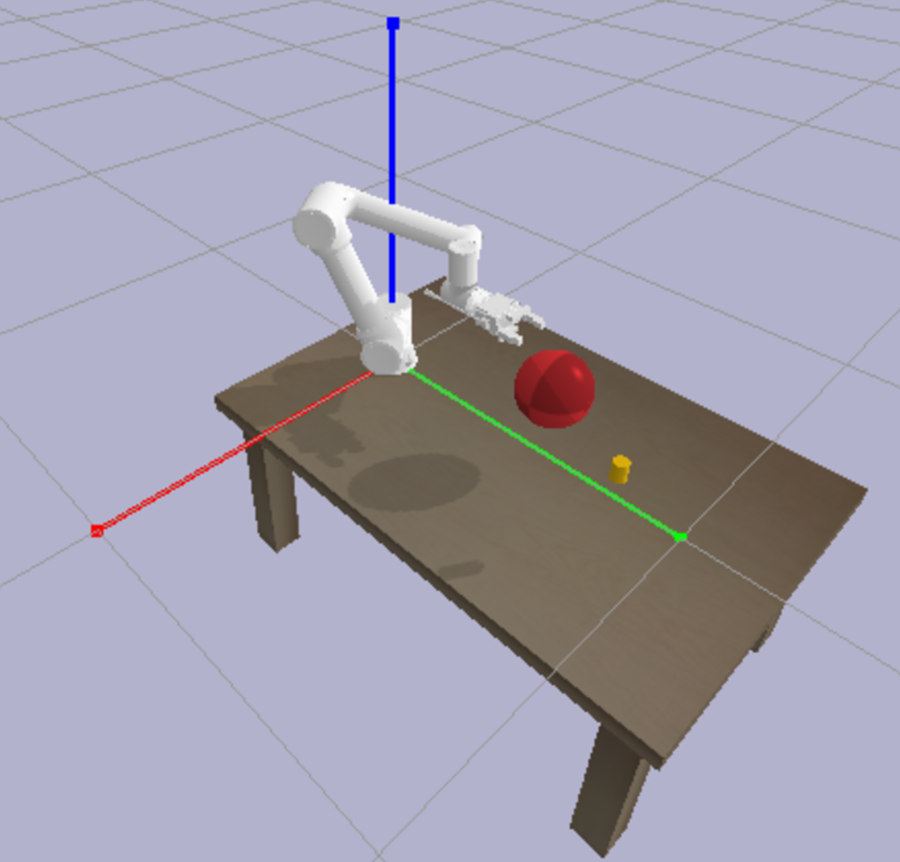

# 2024 种子杯：机械臂避障挑战

## 比赛简介

2024种子杯将为参赛者带来全新的挑战：在障碍物密布的环境中控制机械臂抓取目标物体。本次赛题的核心是使用算法规划路径，精准地避开障碍物，完成抓取任务。比赛环境通过PyBullet模拟，参赛者需要编写算法，实现自动化控制机械臂。

## 赛题背景

在一项关键任务中，机械臂需要精确地抓取一个圆柱体目标物体。然而，前进路径上存在障碍物，参赛者必须让机械臂灵活地避开这些障碍物，才能顺利到达并完成抓取任务。本次比赛要求参赛者修改team_algorithm.py脚本中的`MyCustomAlgorithm`类，以输入当前环境信息，返回六个轴的下一步动作，使机械臂在限定的步数内避障并抓取目标。

## 队伍分类

本次比赛分为低年级组和高年级组，大一大二为低年级组，大三大四为高年级组。两组比赛环境相同，技术限制和评分标准不同。

组队类别按照队伍中最高年级划分，例如：
- 队伍中最高年级为大二年级，则该队伍为低年级组。
- 队伍中最高年级为大三年级，则该队伍为高年级组。


## 任务目标

- **目标物体**：圆柱体，只要机械臂夹爪的中心离目标中心在0.05m以内，即视为抓取成功。
- **障碍物**：0.1m半径的小球。



### 环境参数

- **目标位置**：
  - x轴：随机生成在[-0.2m, 0.2m]范围内。
  - y轴：随机生成在[0.8m, 0.9m]范围内。
  - z轴：随机生成在[0.1m, 0.3m]范围内。
  
- **障碍物位置**：
  - x轴：随机生成在目标位置的x轴左右0.2m范围内。
  - y轴：固定在0.6m。
  - z轴：随机生成在[0.1m, 0.3m]范围内。


## 比赛流程

1. 参赛者在每一步发送六个轴的移动角度（范围：-1度到1度）。
2. 环境将返回12个参数，分别是当前6个轴的角度、目标位置（xyz）和障碍物位置（xyz）。
3. 每轮比赛最多进行100步：
   - 若在100步内避开障碍物并抓取到目标，本轮结束。
   - 若100步后未抓取到目标，本轮结束，分数按夹爪中心与目标中心的距离递减。
   - 若在过程中碰到障碍物，本轮继续进行，但是会有惩罚。

## 评分系统

- **抓取成功**：100分
- **超出步数限制**：根据距离目标0.05到0.2m的范围，分数线性递减，具体公式为 $100 \times \left(1 - \left(\frac{distance - 0.05}{0.15}\right)\right)$
- **碰撞惩罚**：低年级组分数乘0.5，高年级组分数乘0.2。
- **时间限制**：评测系统会自动运行100次仿真统计总长，总时长不能大于120s，否则分数会计0。
- **评测时间**：评测系统从开始后，每天会自动于00:00，06:00，12:00，18:00分别进行四次评测并更新分数。

## 技术细节

- **代码结构**：参赛者需要修改并提交`MyCustomAlgorithm`类中的代码。
  - `MyCustomAlgorithm`类应接受12维输入参数（当前轴角度、目标位置和障碍物位置），并返回六维的动作数组，代表六个轴的移动角度。
- **执行脚本**：执行`test.py`运行比赛模拟，系统将自动计算100轮模拟的平均分数。
- **环境限制**：如果使用强化学习算法，低年级组同学可以使用stable-baselines3库，高年级组同学需要使用pytorch, numpy等自己搭建强化学习算法。深度学习框架只能使用pytorch。
- **硬件限制**：服务器端在推理时不提供GPU算力。

### 必要依赖

- stable_baselines3
- numpy==1.26.4
- scipy
- pybullet

安装依赖：
```bash
pip install -r requirements.txt
```

## 文件说明
- **server.py**：环境类，定义了机械臂的运动学模型和环境交互。
- **team_algorithm.py**：参赛者需要修改的算法类，输入当前环境信息，返回六个轴的下一步动作。
- **test.py**：运行100轮测试，并输出平均分数。

## 示例算法

我们提供了两个算法示例：一个简单的随机动作算法和一个基于PPO的预训练模型。

### 1. 简单随机算法
以下是`MyCustomAlgorithm`类的初始模板：

```python
class MyCustomAlgorithm:
    def __init__(self):
        pass

    def get_action(self, observation):
        """
        根据当前环境状态，计算机械臂的下一个动作。
        
        参数:
            observation (np.array): 长度为12的数组，包含6个轴的当前角度、目标位置xyz、障碍物位置xyz。
        
        返回:
            np.array: 长度为6的数组，包含6个轴的移动角度,范围在-1到1之间，表示角度。
        """
        # 示例：返回随机动作
        return np.random.uniform(-1, 1, 6)
```

### 2. PPO预训练模型
我们还提供了一个使用PPO算法简单训练的模型作为参考：

```python
class PPOAlgorithm:
    def __init__(self):
        self.model = PPO.load("model.zip", device="cpu")

    def get_action(self, observation):
        action, _ = self.model.predict(observation)
        return action
```


## 运行测试
通过替换`algorithm`变量，可以运行不同的算法。

```python
algorithm = PPOAlgorithm()
```

如果不需要图形界面，实例化env时可以设置`gui=False`，实例化Env时is_senior参数为True表示高年级组，为False表示低年级组；seed参数为随机种子。

```python
env = Env(is_senior=True,seed=100,gui=True)
```


组委会提供`test.py`脚本，运行该脚本可以进行100轮测试，并输出平均分数。
```bash
python test.py
```

## 提交方式

- 为了方便服务器测试，选手需要统一输入输出接口，完成`MyCustomAlgorithm`类。

```python
class BaseAlgorithm(ABC):
    @abstractmethod 
    def get_action(self, observation):
        """
        输入观测值，返回动作
        Args:
            observation: numpy array of shape (1, 12) 包含:
                - 6个关节角度 (归一化到[0,1])
                - 3个目标位置坐标
                - 3个障碍物位置坐标
        Returns:
            action: numpy array of shape (6,) 范围在[-1,1]之间
        """
        pass

class MyCustomAlgorithm(BaseAlgorithm):
    def __init__(self):
        # 自定义初始化
        pass
        
    def get_action(self, observation):
        action = np.random.uniform(-1, 1, 6)
        return action
```

选手的项目文件中只需要包括`team_algorithm.py`和所需算法或模型文件，不需要`env.py`,`fr5_description`等环境文件，打包并命名为"队伍名称.zip"提交。

例如：
```
队伍名称/
    team_algorithm.py
    model.zip / model.pth / other model files
```

- 除此之外，为了在服务器测试环境中能够正常运行选手的算法，选手在team_algorithm.py中调用的算法不能简单地用绝对路径或者相对路径表示，必须用os获取当前路径作为相对于team_algorithm.py的绝对路径。例如：
```python
    def __init__(self):
        model_path = os.path.join(os.path.dirname(__file__), "model.zip")
        self.model = PPO.load(model_path, device="cpu")
```

## 参赛支持

如遇到环境搭建或代码运行问题，请联系组委会获取技术支持。

祝各位参赛者好运，期待你的精彩表现！
